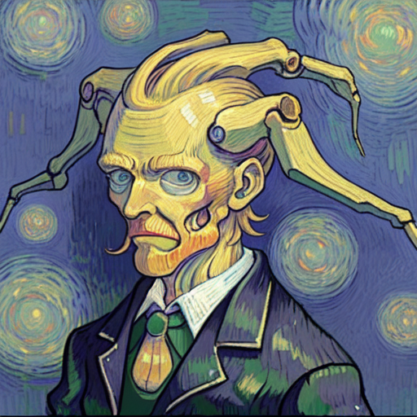
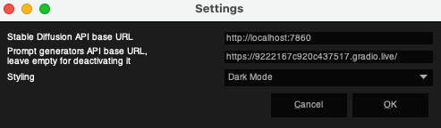
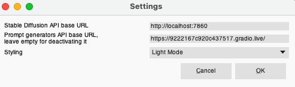

# StableDifference
## Description
***
This is a plugin for GIMP that allows you to incorporate Stable Diffusion into your workflow. It is based on the [AUTOMATIC1111's Stable Diffusion WebUI](https://github.com/AUTOMATIC1111/stable-diffusion-webui).

## Installation
***

1. Download GIMP or verify, that you own the newest version of GIMP [Download Link](https://www.gimp.org/downloads/)
2. Clone [The Stable Diff Gimp Repository](https://github.com/StableDifferenceTeam/StableDiffGimp.git) 
   - by typing `git clone https://github.com/StableDifferenceTeam/StableDiffGimp.git` in your terminal (MacOS/Linux) or command prompt (Windows)
   - or by downloading the zip file [zip file](https://github.com/StableDifferenceTeam/StableDiffGimp/archive/refs/heads/main.zip) and extracting it
3. Go to GIMP and add the Plugin to the list of plugins:
    - Open GIMP
    - Go to `Edit/Preferences/Folders/Plugins`
    - Click on `Add a new folder`
    - Type in the location of your StableDiffGimp **src** folder. It should look something like: **/Users/.../StableDiffGimp/src**
    - Restart GIMP and verify, that you have a StableDifference button in the top bar     
4. Install the AUTOMATIC1111's Stable Diffusion WebUI
  	- You can find the installation instructions [here](https://github.com/AUTOMATIC1111/stable-diffusion-webui#installation-and-running)
  	- Set up the API by going into your now cloned AUTOMATIC1111's Stable Diffusion WebUI folder and changing `commandline_args` in the file `launch.py` to `commandline_args = os.environ.get('COMMANDLINE_ARGS', "--api")`
  	- Now you can start the API by typing `webui-user.bat` in your terminal (MacOS/Linux) or command prompt (Windows)
    	- You have to have [Python](https://www.python.org/downloads/release/python-3106/) installed on your computer
5. Back in GIMP, you can now go to `StableDifference/Settings` and change the Stable Diffusion API base URL to the generated Link
		- The default URL is `http://localhost:7860` (which is your computer)
6. You can now use Stable Diffusion Methods in GIMP!
7. Using prompt generation (optional)
    - Install the Prompt Generator by following the instructions [here](https://huggingface.co/Gustavosta/MagicPrompt-Stable-Diffusion)
    - Go to `StableDifference/Settings` and input your API Link to Prompt generators API base URL
    - Now each time you start a Stable Diffusion method, the prompt you input will be optimized by the prompt generator first
  

## Simple or more advanced?
***
Each of our features has a drop-down menu, so if you are a user with advanced knowledge or you seek more customizability, click on `Expand`
You find an explanation of what each setting does [here](#what-does-each-setting-do?)

## Settings 
***
1. Click on `StableDifference`, then `Settings` 
2. A new window should open up where you can add an API url
	- The default URL is `http://localhost:7860 `(which is your computer) 
3. Choose if you want to use our prompt generator
	- A prompt generator helps you to choose a prompt
4. In the drop-down menu below, you can choose between Dark Mode, Light Mode or None for your pop-up windows
	- Dark Mode lets all of the pop-up windows appear in a dark theme, light mode in light and none in a classic theme
    
    
    

## Our features
***
- Before getting started, please note that all of the buttons are greyed out before adding an image or a new canvas
	- To add an image, you can use drag and drop
	- To add a new canvas, click on `File`, then `New`
- Overview:
	- [Image to Image](#image-to-image)
	- [Inpainting](#inpainting)
	- [Text to Image](#text-to-image)
	- [Uncrop](#uncrop)
	- [Upscale](#upscale)
- Depending on the step number and other factors, it may take some time to create an image.
    

### Image to Image
Modifies an existing image

1. Make sure you have an image in your GIMP 
2. Click on `StableDifference`, then `Image to Image`
3. A window should open up with a [prompt](#prompt), a [denoising strength](#denoising-strength) and a drop-down menu     
	- Click on expand to customize further
	- [Here](#expandable-menu) are our advanced options     
4. Choose your input and click on `Ok`     
5. You modified your image!     

### Inpainting
Paints a new image inside an existing image

1. Make sure you have an image in your GIMP
2. Create a new layer and call it `Inpainting Mask`     
3. Mark the area you want the prompt to appear in      by painting it Black
4. Click on `StableDifference`, then `Inpainting`
5. A window should open up     
6. Write a [prompt](#prompt), choose a [denoising strength](#denoising-strength) and [steps](#steps)
	- Click on expand to customize further     
	- [Here](#expandable-menu) are our advanced options
7. Choose your input and click on `Ok`
8. You modified your image!     

### Text to Image
Creates a new image from a prompt

1. Click on `StableDifference`, then `Text to Image`
2. A window should open up     
3. Write a [prompt](#prompt) and choose [steps](#steps)
	- Click on expand to customize further     
	- [Here](#expandable-menu) are our advanced options
4. Click on `Ok`
5. You created an image by text!     

### Uncrop
Uncrops an existing image to a variable size and adds a prompt

1. Insert an existing picture into your GIMP     
2. Click on `StableDifference`, then `Uncrop`
3. A window should open up     
4. Write a [prompt](#prompt)
5. You can see different sliders for padding on the top, bottom, left and right 
	- Each slider lets you choose how much space you add on the according side
 	- When a slider is set to 0, it will not be extended on that side, speeding up the process	
6. Choose in how many [steps](#steps) you want your image to be completed     
	- Uncrop benefits from a high number of steps, so consider about 80-100 Steps
 	- This will result in a better result, but it will take longer to generate	
7. If you have settled on a number, click on `Ok`
8. The image is now uncropped!     

### Upscale
Makes an image higher-defined

1. Insert an existing picture into your GIMP     
2. Click on `StableDifference`, then `Upscale`
3. A window should open up     
4. Choose an [upscaling factor](#upscaling-factor)     
5. If you have settled on a number, click on `Ok`
6. The image is now upscaled!     

## What does each setting do?
***
#### Prompt
- In textform, write what you want to generate

#### Denoising strength
- The higher the denoising strength, the less the output image will look like the input image

#### Steps
- The more steps, the more definition

#### Upscaling Factor
- How much the image will be upscaled
    - The higher the number, the more upscaling it will have

------------

## Expandable menu
***
#### Negative Prompt
- What you do not want your image to include 

#### Seed
- A number from which Stable Diffusion adds noise to the picture

#### Sampler
- A sampler creates a clear picture from noise
- We have multiple samplers to choose from

#### Restore faces
- If you set it to `True` you can fill in missing or distorted parts of a face 

#### CFG
- Means Classifier Free Guidance scale
- The higher the number, the more closely Stable Diffusion follows your prompt

#### Number of Images
- How many images you want to create

#### Results as 
- If you want your result to be a layer in your GIMP or an image

***
The following settings are just for inpainting

#### Inpainting fill
- How the Inpainting Mask is initialized
- You can choose between four options

#### Inpaint at full resolution
- If you set it to `True`, you will inpaint at full resolution

#### Full resolution Inpaint padding
- Set a padding for your inpainting with the slider
	- 0 means no padding

#### Autofit Inpainting Region
- If you set it to `True`, the generated image will automatically fit your inpainting region

#### Mask Blur
- With the slider, set a blur of the Inpainting Mask
	- The higher the number, the higher the blur

#### Apply Inpainting Mask
- Set to `True`, if you want to apply the Inpainting Mask to your output

***
The following settings are just for upscaling

#### Upscaler 1 and Upscaler 2
- Choose between multiple upscalers 

#### Upscaler 2 visibility
- Choose how visible the second upscaler is
    - The higher the number, the more visible is the upscaler
